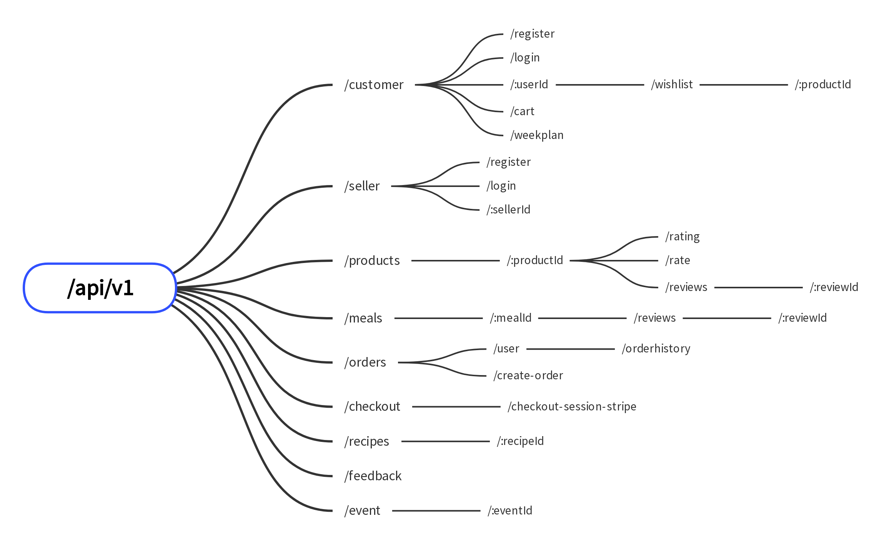

# Running the Application

## Prerequisites:

- A `.env` file created by copying the `.env.example` and replacing placeholders with your actual API tokens.

## Methods:

### Using npm

1.  Install dependencies:

```Bash
npm install
```

2. Start the application:

```Bash
npm start
```

### Using Docker

1.  Build the Docker image:

```Bash
docker build -t ahmedzein/wellness .
```

2. Run the Docker container:

```Bash
docker run --rm ahmedzein/wellness
```

The application will be accessible on port 3000.

# API Structure



**For a detailed demonstration of features, please refer to our demo notebook:**

[Link to demo notebook](demo/demo.ipynb)
